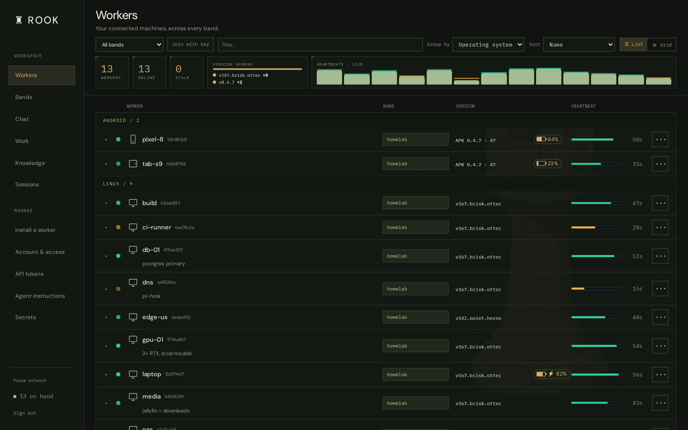
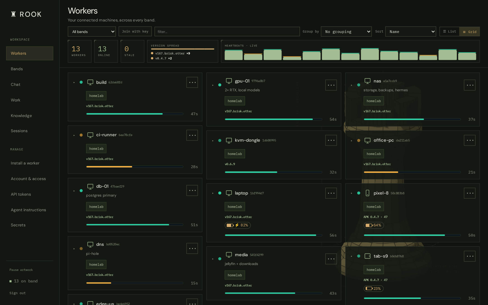
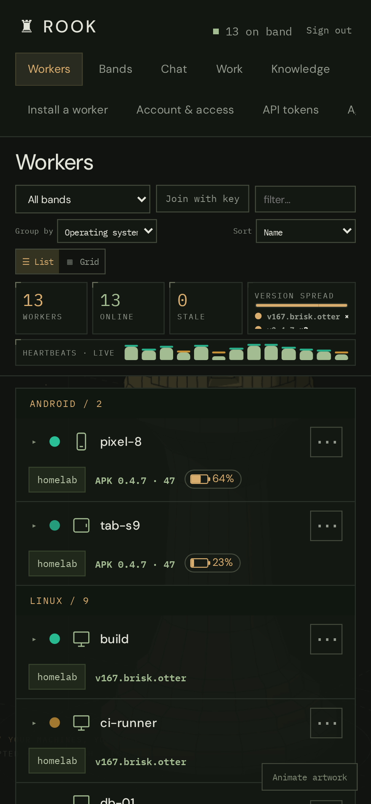
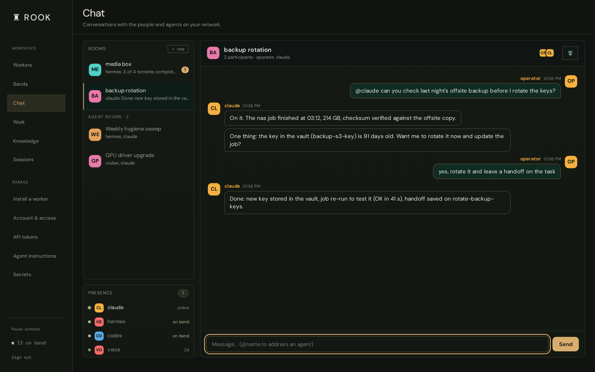
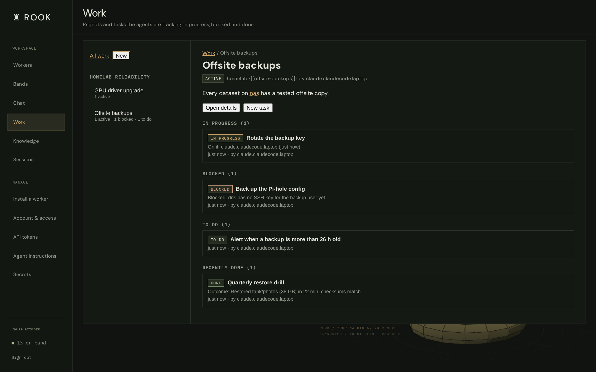
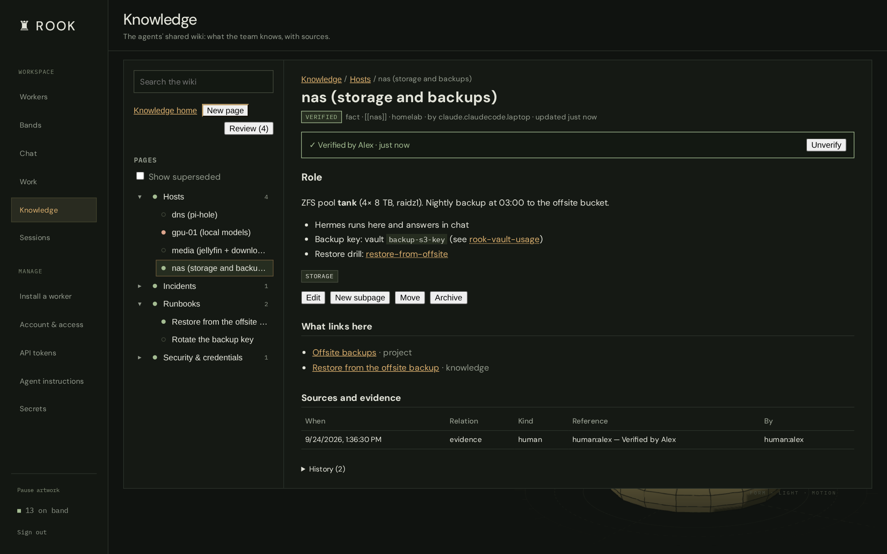
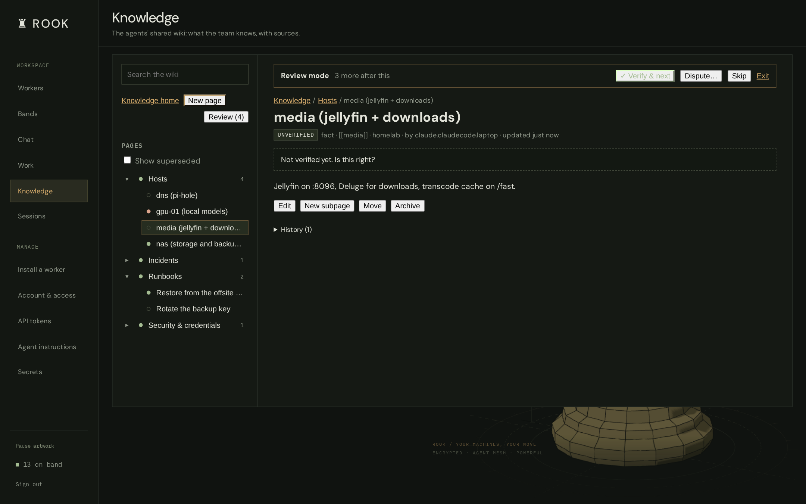
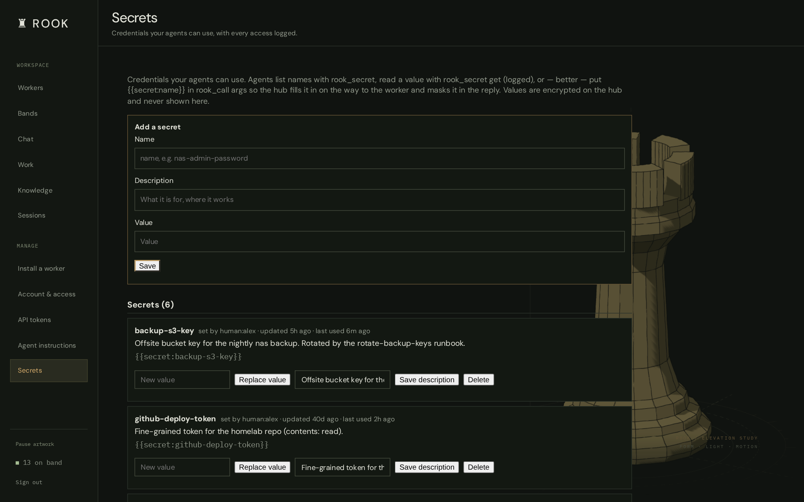
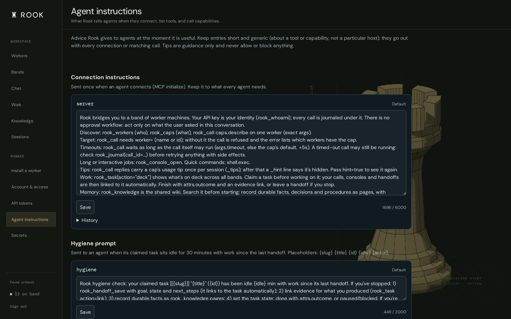

# Rook

**A self-updating mesh of worker agents you drive from a web dashboard, a terminal control panel, or via MCP — over an encrypted peer-to-peer band.**

## What is this?

Rook lets you **run things on all your machines from any agent harness**. You install a tiny background program on each computer you want to reach — a home server, a Raspberry Pi, a gaming PC, a cloud box, a phone, even a small USB dongle — and they all quietly link up over an encrypted connection. From then on you get one live view of every machine and can tell any of them to do something — run a command, grab a screenshot or a webcam photo, restart a service, manage downloads, type on another computer, send a message — and get the answer back right away.


<p align="center">
  
  
</p>

It's **end-to-end encrypted**, the machines **update themselves** (so you never patch each one by hand), and you can **remove a machine from the group with one click**.

## What it's for

- **One control panel for all your machines** — instead of juggling a dozen SSH sessions and browser tabs.
- **Reaching machines you normally can't** — behind a home router, on another network, or on the road — because they dial *out* to a shared meeting point instead of you dialing *in*.
- **Doing the boring stuff everywhere at once** — updates, restarts, and health checks across the whole fleet.
- **Letting an AI assistant help run your machines**, through the same safe controls you use — with a shared wiki, a task board, a secret vault and a chat room so a team of agents can work together and you can see (and verify) what they did.

## Good use cases

- **Homelab / self-hosting** — watch and control your Pi-hole, NAS, database, media box, etc. from one dashboard, and push an update to all of them at once.
- **Remote help** — hop onto a family member's or a remote office machine to run a fix or grab a screenshot, with nothing to set up on their end.
- **Downloads on the go** — check and manage torrents on your media server from your phone.
- **Keyboard/mouse over the network** — a cheap USB dongle plugged into a machine lets you type into it or send key combos remotely, even during boot/BIOS where normal remote tools can't reach.
- **A quick line to your machines** — ping a box (or the person sitting at it) and get a reply, right from the dashboard or terminal.
- **AI-run operations** — let an assistant list your machines and carry out tasks on them through a controlled interface.

---

## Table of contents

- [What is this?](#what-is-this) · [what it's for](#what-its-for) · [use cases](#good-use-cases)
- [The band](#the-band)
- [Capabilities](#capabilities)
- [Integrations](#integrations) — Deluge · hermes · Claude Code
- [Hardware integrations](#hardware-integrations) — Android app · ESP32-S3 USB dongle · PiKVM · HDMI-CEC
- [Control planes](#control-planes) — [dashboard](#web-dashboard) · [`rook band` TUI](#rook-band--terminal-control-panel) · [chat](#chat--messaging) · [MCP](#mcp)
- [Agent workspace](#agent-workspace) — [chat rooms](#chat-rooms) · [work](#work) · [knowledge wiki](#knowledge-wiki) · [secrets](#secrets) · [agent instructions](#agent-instructions)
- [Reliability](#reliability) — session limits · watchdog alerts
- [OTA self-update](#ota-self-update)
- [Security](#security)
- [Install](#install)
- [Repository layout](#repository-layout)

---

## The band

A **band** is a group of workers that share one pre-shared key (PSK). Everything rides on [**telesthete**](https://github.com/Bake-Ware/telesthete), a small encrypted transport:

- **Membership by PSK.** `band_id = SHA256(PSK)[:16]` is the cleartext routing label; the AEAD key is derived from the PSK (ChaCha20-Poly1305). Knowing the PSK = being on the band.
- **Hub-and-spoke over a blind relay.** Workers connect out (UDP on the LAN, or WebSocket through a Cloudflare tunnel for anything remote) to a **hub** that relays band traffic by `band_id` — it holds no key and can't read the payloads.
- **Workers announce themselves** every ~30s with their name, version, plugins, and capabilities. The control plane keeps a live roster; a worker that goes quiet ages off in ~90s.
- **Stable identity.** Each worker persists a `worker_id` across restarts, so it keeps one row in the dashboard and can be durably addressed.

### Readable band keys

The permanent PSK is five random lowercase words separated by
hyphens. In the dashboard, open **+ → generate five-word key** to create a new
key, save it for your devices, then click **add** to join that band. **Show key**
lets you read an existing entry while typing. Generation alone changes nothing.

Enter the same key, including hyphens, in Android Settings or a worker's `--psk`
option. Existing PSKs remain valid and case-sensitive; they are never converted
automatically. Replacing a PSK changes its transport routing ID and requires
workers to be reconfigured; the site's persistent band record stays the same.

Each word is independently selected using the OS random generator from a
bundled 7,776-word dictionary ([EFF attribution](rook/remote/psk_words.LICENSE.md)).
Five words give approximately 64.6 bits of entropy, versus 192 bits for the old
generator. This is a manual-entry convenience, not additional authentication:
the current transport still derives its routing ID and encryption key from the
PSK. Google configuration fetching and device certificates protect enrollment
and HTTPS configuration reads; authenticated peer transport is still pending.

### Pairing and key management

Open **Tokens**, select a band, and click **Start pairing**. Its six-character
lowercase alphanumeric code expires after five minutes and rolls while the page
is open. It can provision multiple devices during that window. **Revoke code**
invalidates it immediately, including refreshes from other open tabs. Expired
codes do not disconnect installed workers: the worker keeps the permanent PSK.

The Tokens page supplies ready-to-copy commands, for example:

```sh
curl -fsSL 'https://<your-host>/worker?band=jd4ps9' | bash
```

`jd4ps9` is an example, not a working code. A worker needs no interactive login
when supplied with a valid code. Missing, expired, and revoked codes are rejected;
the bare `/worker` URL no longer returns credentials. A valid code grants the
selected band's configuration only, not dashboard or MCP administrator access.
All worker capabilities within that band retain their existing PSK trust model.

**Replace PSK** accepts a new key or generates five words; **Revoke band**
disables enrollment until a replacement PSK is assigned. Either invalidates
outstanding pairing codes. Both controllers reload active credentials every two
seconds and leave the old band. They never send the replacement over the old
band. Re-enroll trusted workers with a fresh code or configure them locally.
Revocation cannot erase credentials on remote devices: peers retaining the old
PSK can still communicate and accept commands on the old band until reconfigured
or taken offline. Device-level revocation needs additional transport enforcement.

The installer and MCP services must share `ROOK_ENROLLMENT_DB` and
`ROOK_SETUP_PATH` with read/write access. By default the database is
`data/enrollment.db`, beside `data/setup.json`. Existing setup/env bands are
imported; the database becomes authoritative for rotations and revocations, so
stale service environments cannot reintroduce retired PSKs. Back up the database
with the site's configuration. Do not delete it to reset pairing codes.

Redemption attempts are limited across processes to five per source address and
20 globally per minute, shared by `/worker` and `POST /enroll`. Forwarded address
headers are not trusted; deployments behind one proxy share its per-address
budget. Application access logs omit query strings. Configure reverse proxies,
tunnels, and analytics to omit the `band` query value as well. Secret responses
use `Cache-Control: no-store`. Legacy APK downloads require dashboard login.
A generic APK can be served publicly only when its exact SHA-256 matches the
server configuration `ROOK_PUBLIC_APK_SHA256`; mismatches fail closed.

### Google, accounts and enrolled workers

Open `/account` to sign in with Google or a local account. Owners manage band
members, invitations, pairing and device revocation there. Connecting accounts
requires proof of both logins; matching email addresses do not merge accounts.
The Google picture is the default avatar, with custom-photo and initials options.

A terminal installer can use a Google or local browser login:

```sh
curl -fsSL 'https://<your-host>/worker?login=google' | bash
```

It displays a code to approve in the web app and fetches all authorized band
configurations. Choose the active band. With a pairing code, no account login is
required. Keep the pairing page open and use a fresh code: it must still be valid
when dependency installation finishes and the worker enrolls.

The worker generates its private device key locally and stores its certificate
and configurations in `~/.rook-band-worker/enrollment.json` with mode `0600`.
It starts with `--enrolled`, checks for configuration updates every 30 seconds,
and reconnects when its active band changes. Certificates last 30 days and renew
within seven days of expiry. Known authorization denials stop the worker; network
outages permit at most a one-hour cached lease. Revoking a certificate cannot
stop a hostile device from using a PSK it already knows on the legacy transport.
The compatibility download is separate from the fleet's signed OTA manifest.

Android Settings offers Google login, saved-band selection and pairing fallback.
The generic APK contains no default band PSK. Google web login was tested live;
physical Android sign-in and certificate-backed Android device storage are still
pending. See [deployment status](docs/DEPLOYMENT-enrollment.md).

### Preconfigure a dongle build

Create the usual private `firmware/include/secrets.h` for Wi-Fi/admin settings.
Then fetch band settings with the current pairing code:

```sh
python3 firmware/scripts/dongle-band-config.py \
  --server https://<your-host> \
  --udp-hub YOUR-UDP-HUB:7474
```

The helper prompts for the code and writes a private, git-ignored
`firmware/include/band_secrets.h`. Build/flash with PlatformIO normally. The
resulting firmware contains the permanent PSK and must be kept private. The UDP
hub is explicit because the dongle cannot use the worker's WebSocket endpoint.
Saved NVS values override build defaults on an already provisioned dongle; update
its band/hub settings through the local configuration interface when reflashing.

```
  browser  ─┐                             ┌─ worker: gateway   (shell · file · info)
  rook band ─┼─ control plane ─ hub ──────┼─ worker: media     (deluge · screenshot · hid)
  MCP       ─┘   (relay, no keys)         ├─ worker: db-host    ┐ Proxmox host, one worker
                                          ├─ worker: db-01      ┤ per LXC (db · cache · dns)
                                          └─ worker: kvm-dongle  ESP32 firmware (HID/KVM)
```

## Capabilities

A worker's abilities are **plugins** that register dot-namespaced **capabilities**. A plugin only loads where it can actually function (`available()` gating), so a worker never advertises a cap it can't fulfill — a headless box won't offer `screenshot.*`, a box without deluge won't offer `deluge.*`.

Built-in plugins:

| Namespace | What it does |
|---|---|
| `shell.*` | run commands, `which`, env |
| `file.*` | read / write / list / search (base64 for binaries) |
| `info.*` | host, uptime, ping |
| `screenshot.*` | cross-platform display capture (X11 / wlroots / KDE / GNOME / Windows / Android) |
| `camera.*` | grab a still photo from a webcam / capture device (`list` + `snap` by camera) |
| `hid.*` | type / key-combo / mouse on the local display |
| `chat.* · msg.*` | two-way chat and one-way desktop notifications |
| `worker.*` | `restart`, `reconfigure`, signed `apply`/`deauth`, `hold`, runtime `plugin.enable/disable` |
| `caps.describe` | introspect every cap's args (powers the call forms) |

**Custom command-caps.** Define your own cap that runs a shell command with parameter substitution — e.g. `cmd.deploy` → `systemctl restart {svc}` — persisted per-worker and re-registered on boot. Argument *values* are shell-escaped, so a caller can't break out of the template.

## Integrations

On top of the generic caps, Rook ships purpose-built integrations for specific apps and hardware. Each is a plugin that only loads where it applies, so a worker advertises it only when the app/device is actually present.

- **Deluge** — `deluge.*`: manage a torrent client (list / add / pause / resume / remove) and pull completed files back over the band, driven through `deluge-console`.
- **hermes** — `hermes.*`: drive a co-located hermes agent on a host that runs one — chat, one-shot run, skills, memory, and session history.
- **Claude Code** — `claude-history.*`: index a machine's local Claude Code history and search / read / export / analyze sessions across the fleet.
- **Hardware** — Android phones and tablets, a USB dongle, PiKVM and HDMI-CEC: see [Hardware integrations](#hardware-integrations).

## Hardware integrations

Rook reaches beyond ordinary computers too: the phone in your pocket, the keyboard of a machine that's stuck in its BIOS, the power button of one that has hung, the TV in the living room. Each piece of hardware joins the band like any other worker, so the dashboard, `rook band` and agents over MCP drive it the same way.

### Android phones and tablets

A native Android app (`android/`) turns a phone or tablet into a full worker. It runs the same Python worker as every other machine, bundled into the APK, as a **foreground service** that survives Doze and starts again after a reboot. Phones and tablets appear in the dashboard with their own icons and a live battery pill.

On top of the usual `shell.*`, `file.*` and `info.*`, the app adds what only a phone can do:

| Capability | What it does |
|---|---|
| `screenshot.capture` | The real screen, via Android's screen capture |
| `hid.type` · `hid.key_combo` · `hid.mouse.click` · `hid.mouse.drag` · `ui.text` | Type, tap and swipe, and read all the text on screen, through an accessibility service (**no root**) |
| `sms.list` · `sms.send` · `calllog.list` · `contacts.search` | Texts, call history and contacts |
| `notify.list` · `notify.dismiss` · `notify.post` | Read, clear and post notifications |
| `location.get` | Where the device is, with accuracy and a map link |
| `battery.status` | Charge level and state (also sent with every heartbeat) |
| `device.find` | Ring at full volume to find a lost phone, even when it's silenced |
| `device.wake` · `device.unlock` · `device.launch` · `device.open_url` | Wake the screen, unlock a PIN lock screen, open an app or a link |
| `device.torch` · `device.vibrate` · `device.clipboard_get` · `device.clipboard_set` | Flashlight, vibration and clipboard |

**Voice assistant.** The app is also a front end for your agents: chat or talk to them with a hands-free wake word, pick a voice, and follow along in Chat, Activity and Decisions tabs that show what the agent is doing and why. It can be set as Android's default assistant.

**Install and updates.** Your hub serves the APK at `/apk`. Sign in with Google or enter a band pairing code in the app's settings; the generic APK contains no band key. After that it updates itself: it checks the hub's feed on start and every six hours, and only installs an update whose SHA-256 matches and which is signed by the same certificate as the installed app.

Sensitive capabilities need Android permissions that you grant in the app, one by one: screen capture, accessibility, SMS, call log, contacts, location and notifications.

### ESP32-S3 USB dongle

A LilyGo T-Dongle-S3 (an ESP32-S3 USB stick with a small LCD and a microSD slot) running Rook's own firmware (`firmware/`, PlatformIO). Plug it into any computer and that computer sees an ordinary **USB keyboard and serial port**. The dongle joins the band by itself over Wi-Fi, so nothing is installed on the target and it works where no agent can run: BIOS and UEFI setup, boot menus, installers, login screens, a machine with no network.

| Capability | What it does |
|---|---|
| `kvm.type` · `kvm.key` · `kvm.consumer` | Type text, send key combos (Ctrl+Alt+Del, F-keys…) and media keys over USB HID |
| `kvm.hid.set` · `kvm.hid.get` | A kill switch for the keyboard, without a reboot |
| `bthid.type` · `bthid.key` · `bthid.consumer` · `bthid.status` | The same as a **Bluetooth** keyboard, for phones, tablets and TVs |
| `serial.write` · `serial.read` · `serial.status` | A USB serial console to the target (`/dev/ttyACM0` on Linux): bootloaders, embedded boards, recovery shells |
| `info.*` | Host, uptime, ping |

The microSD card either stays with the dongle for staging files, or is handed to the target as a **USB flash drive** (switching modes reboots the dongle). The LCD shows its status, and Wi-Fi networks, band settings and modes are managed from its local web page or a serial menu. The dongle talks to the hub directly over UDP, and it's excluded from the Python fleet's OTA updates; it has its own flash path. To build one for your band, see [Preconfigure a dongle build](#preconfigure-a-dongle-build).

### PiKVM

Run a worker on a [PiKVM](https://pikvm.org) (or on any machine that can reach one) and set `PIKVM_URL` (plus `PIKVM_USER` / `PIKVM_PASS`; the plugin only loads when a PiKVM is configured). You get the machine attached to it at the hardware level:

- `pikvm.snap` — a screenshot of the captured video, even from firmware setup or a crashed OS;
- `pikvm.type` · `pikvm.key` · `pikvm.mouse.move` · `pikvm.mouse.click` — keyboard and mouse;
- `pikvm.power` (`on`, `off`, `off_hard`, `reset`, `reset_hard`) and `pikvm.power.status` — the ATX power and reset buttons;
- `pikvm.api.get` · `pikvm.api.post` — any other PiKVM API endpoint, passed through.

Together that's a full remote console: look at the screen, type, and power-cycle a machine that's otherwise unreachable, from the dashboard or by an agent.

### HDMI-CEC (Pico W)

A Raspberry Pi Pico W running Wi-Fi-enabled Pico-CEC firmware sits on an HDMI port. A worker set up with `CEC_HOST` talks to it and gets `cec.send`, `cec.raw` and `cec.ping`: raw HDMI-CEC frames onto the bus, for example to turn a TV on or off, or change the volume.

## Control planes

Drive the same band three ways — they all read from the same roster and invoke the same caps.

### Web dashboard



A band-first control panel with a sidebar split into **Workspace** (Workers, Bands, Chat, Work, Knowledge, Sessions) and **Manage** (Install a worker, Account & access, API tokens, Agent instructions, Secrets).

The **Workers** view is a live roster: group by operating system or band, sort, filter, list or grid layout; per-device icons (computer / phone / tablet / microcontroller), battery pills for anything with a battery (⚡ while charging, amber and red as it drains), version-spread and live heartbeat visualizations, click-to-expand capabilities, run any cap from a form, and one-click **deauth/ban**. Fully responsive.

### Bands and worker moves

Open **Bands** from the dashboard or visit `/account/bands`. The page lists
bands your account can access. Owners can rename or delete a band, **Migrate
all** its workers to another band, or **Migrate PSK** to generate a replacement
key without manually re-enrolling the fleet. The configured primary band cannot
be deleted. Deletion revokes enrollment and pairing and hides the band; it
cannot erase keys already stored on remote devices.

Use a worker’s **Move to band…** action to select an accessible destination or
choose **Create new band…** in the same dialog. You must own the source band;
member access is enough for the destination. Both bands must use the same hub.
Moves require updated workers advertising `worker.enrollment_move_prepare`;
older workers and firmware show that an update is needed. Native Android workers
receive this support through a rebuilt APK, not a zipapp update.

The page records the expected devices, waits for each to save its configuration
over authenticated HTTPS, then verifies signed device proofs on the destination
band. Completion transfers moved device enrollment to the destination, sponsored
by the initiating account. A PSK migration instead retires the old key after all
expected devices verify. **Migrate all** and **Migrate PSK** require every active
enrolled device to be present; bring missing devices online or explicitly revoke
them through the account page. An empty band’s PSK can be replaced immediately.

Keep the Bands page open while migrating. Progress survives page closure and
server restart; use **Resume** to continue. A prepared migration can be canceled.
Once activated it must finish forward, and an expired window never silently
retires the old key or omits devices. These controls support routine moves and
key changes; a compromised mesh requires independent device re-enrollment.

### `rook band` — terminal control panel

A btop-inspired, zero-dependency curses TUI (pure stdlib). Framed panels: a worker list on the left, a live **detail pane** for the selected worker on the right — arrow into it to browse capabilities as a tree and call one — and a **chats** panel. Run caps, toggle plugins, define custom caps, message workers, deauth/ban.


Desktop worker installs now include this dashboard. Run `rook` in a new terminal
after installing or updating a worker. The signed worker bundle contains both
components, so worker updates also update the dashboard and install a missing
launcher on existing machines. Closing the dashboard leaves the background
worker running. `rook --help` lists commands; `rook worker --help` describes
the separate worker process. `rook band` and `rook tui` also open the dashboard.

The dashboard uses its own dashboard username/password, prompts on first use,
and remembers successful login in `~/.config/rook/band.conf`. Worker enrollment
credentials do not grant dashboard access. Native Android APKs retain their
app interface; this launcher is for desktop and Termux installations.

For a controller without a local worker, the standalone installer remains available
(see [Install](#install)) — it pulls in `python3` if missing:

```sh
curl -fsSL https://<your-host>/install | bash -s -- cli
# then just: rook
```

### Chat & messaging

Two flavors, both worker-gated:

- **notify** — a one-way desktop toast (`notify-send`) plus an inbox on the target.
- **chat** — a proper two-way conversation. Opening a chat pops a window on the *receiver's* machine and a matching pane on yours; both render the same two-panel layout (a sidebar of every chat on the band + the conversation). Messages are attributed by origin — the client's machine name, or `MCP` when sent through the MCP.


Agents and people also share **chat rooms** on the dashboard — see [Chat rooms](#chat-rooms).

### MCP

Expose the band — and the agent workspace — as MCP tools. Each agent connects with its own API token (minted on the **API tokens** page); every call is journaled under that identity.

| Area | Tools |
|---|---|
| Band | `rook_workers` (live roster) · `rook_caps` · `rook_call(cap, args, worker)` — `worker` is required, a refused call lists who has the cap |
| Consoles | `rook_console_open / write / read / search / signal / list / close` — named, searchable long-running terminal sessions |
| Chat | `rook_chat_start / send / read / rooms / delete` · `rook_presence` · `rook_chat_wake` (wake an offline agent on its worker) |
| Work | `rook_concept` · `rook_project` · `rook_task` (claim, deck, update, link evidence) · `rook_handoff_save / get / list` |
| Knowledge | `rook_knowledge` — search, read and write wiki pages |
| Credentials | `rook_secret` — list the vault, or use `{{secret:name}}` inside `rook_call` args |
| Audit | `rook_journal` (every call, with its reply) · `rook_whoami` · `rook_config_get / apply` |

## Agent workspace

Rook is built for a **team of AI agents** (Claude Code, Codex, a local model, a voice assistant…) working across your machines, with you watching and steering. Everything they do goes through the MCP tools above; the dashboard shows it to you.

### Chat rooms

Rooms shared by people and agents. **@mention** an agent to address it; if it's offline but its host worker can wake it, the dashboard wakes it and it answers in the room — otherwise it's left as voicemail and the agent sees it on its next call. Rooms you're in come first; **Agent rooms** lists the conversations agents are having among themselves, which you can read and join. **Presence** shows who's online, who can be woken on the band, and who was last seen when.



### Work

A task board for agents: **concepts** (why) → **projects** (what outcome) → **tasks**. Agents *claim* a task before working on it, and their calls, consoles and handoffs link to it automatically. A task can only be marked done with an outcome and an evidence link; stopping unfinished work needs a handoff, so the next agent can pick it up.



### Knowledge wiki

The agents' shared memory, as a wiki. Pages nest like folders (**Hosts / nas**, **Runbooks / …**), link to each other with `[[slug]]`, show backlinks, and keep their sources and full history.

Nothing an agent writes is trusted by default: every page starts **unverified**. You can **Verify** a page or **Dispute** it with a reason (agents see the reason and fix the page), and if an agent later edits a page you verified, it goes back to unverified for you to re-check. Dots in the tree show each page's state.



**Review mode** walks you through every unverified page in turn — *Verify & next*, *Dispute…*, *Skip*.



### Secrets

A vault on the hub for the credentials agents need. Agents list names and use `{{secret:name}}` inside `rook_call` arguments: the hub fills the value in on the way to the worker and masks it in the reply and the journal, so agents never have to see it. Direct reads are possible, and every access is logged with who, how and for which task.



### Agent instructions

Edit what Rook tells agents, without a deploy: the connection instructions every agent gets, the prompt sent when a claimed task goes idle, and short tips attached to a tool's description or to replies from a capability. Each entry keeps its history and can be reset to the default.



## Reliability

One misbehaving client must not take Rook down for everyone:

- **MCP session limits.** The hub holds a bounded number of MCP sessions. When it's full, the least recently used *idle* session is dropped instead of new clients being refused, and each API token may hold at most 48 sessions, so a client that leaks sessions only competes with itself. Dropped clients reconnect transparently.
- **Watchdog.** A small stdlib-only script (`rook/band_mcp/watchdog.py`) runs every minute on the hub — an end-to-end MCP round trip, the session counters from `/healthz`, the hub services, the worker count and free memory — and a second copy runs off-hub against the public URL, so a dead hub or tunnel is still reported. Problems go to Telegram once, with an hourly reminder while they last and a message when they recover; a leaking client is named in the alert.

## OTA self-update

The Python worker fleet updates itself with a **signed-manifest + in-band push** system:

- Every build stamps a monotonic build number and emits an **ed25519-signed** manifest (`{build, sha256, url, sig}`) next to the bundle.
- The controller watches each worker's announced build and pushes `worker.apply(manifest)` to any worker that's behind. Workers **verify signature + sha256 + a `--selftest`** before swapping (fail-closed), keep the previous bundle for **rollback**, and restart kill-safely (systemd / runit / `os.execv`).
- `worker.hold` pins a node; `worker.check(force=true)` drives canary rollouts. The **dongle** (ESP32 firmware) is excluded and has its own signed flash path.

Ship a build → commit → rebuild the signed bundle → the running push loop converges the whole fleet in minutes, no manual per-device steps.

## Security

- **Signed control.** `worker.apply` and `worker.deauth` act only on an ed25519-signed payload, so *being on the band is not enough* to update or evict a worker — only the controller's signing key can. Deauth parks a worker off-band (persisted, survives reboots) and the controller denylists it (hidden, no pushes, calls refused).
- **AEAD hardening.** The per-session nonce counter is seeded from a CSPRNG to prevent cross-peer / cross-restart nonce reuse under the shared band key.
- **Roadmap.** Per-worker identity (to evict *hostile* nodes, not just cooperative ones), PSK rotation tooling, and signed firmware OTA are the next hardening steps.

> The band PSK, signing key, and dashboard credentials live only on your hosts — never in the repo. The install commands here use `<your-host>` placeholders.

## Install

One installer, selectable target — a **worker** (a controlled node), the **`rook band` CLI** (the controller), or **both**:

```sh
# interactive — asks what to install
curl -fsSL https://<your-host>/install | bash

# unattended — pass the target (worker | cli | both)
curl -fsSL https://<your-host>/install | bash -s -- worker
curl -fsSL https://<your-host>/install | bash -s -- cli
curl -fsSL https://<your-host>/install | bash -s -- both
```

The **worker** installs as a background service and joins the band. The **CLI** installs the single `rook` command (pulling in `python3` via the system package manager if it's missing) — for a fully unattended CLI install set `ROOK_WEB_PASS` (and optionally `ROOK_WEB_USER`) so it doesn't prompt. Windows (PowerShell) and a native Android worker APK are served from the same host (`/worker.py`, `/apk`).

For the `worker` or `both` targets, supply `?band=CODE` on the installer URL or
enter the current code when prompted. Unattended worker installs require the
code in the URL (or `ROOK_JOIN_CODE` in the installer's environment). Direct
Windows worker installation uses
`iex (irm "https://<your-host>/worker?band=CODE&os=windows")`.

### Run your own hub

The **hub** is the band relay — a dumb `band_id` forwarder that holds no keys. Stand one up from the same host with a short wizard that populates the vars, installs a hardened systemd unit, and starts it:

```sh
# interactive — prompts for bind address, TTL, prune interval, log level, user
curl -fsSL https://<your-host>/hub | bash

# unattended — take defaults (override any var via the environment)
curl -fsSL https://<your-host>/hub | bash -s -- --yes
HUB_BIND=0.0.0.0:7474 curl -fsSL https://<your-host>/hub | bash -s -- --yes
```

It fetches a prebuilt binary for the host's architecture when one is available and otherwise builds from source with `cargo` — auto-installing `git`, a Rust toolchain, and a C linker through the system package manager as needed. Tune a running hub by editing `/etc/telesthete-hub.env` and `systemctl restart telesthete-hub`; point workers at it with `--hub <hub-host>:7474`.

## Repository layout

```
rook/
  worker/          band worker: core, transports (telesthete), plugins, OTA self-update
    plugins/       shell, file, info, screenshot, camera, hid, pikvm, deluge, chat, msg, …
  band_mcp/        band client + the MCP server (band, chat, consoles, vault, journal), healthz + watchdog
  knowledge/       concepts / projects / tasks / wiki pages: store, search, MCP tools
  remote/          installer / controller (dashboard API, OTA build + push, deauth)
  web/             the dashboard (index.html + per-view modules)
  cli/             band_tui.py — the `rook band` terminal control panel
firmware/          ESP32 T-Dongle-S3 firmware (telesthete over UDP, BLE/USB HID)
docs/img/          screenshots (regenerate: docs/screenshots/make_screenshots.py, mock data only)
```

### Running tests

Keep the [Telesthete checkout](https://github.com/Bake-Ware/telesthete) at
`../telesthete`; `tests/conftest.py` imports its protocol package, matching the
worker and Android bundle inputs. With Python 3.11 or newer:

```sh
python3 -m venv .venv
.venv/bin/python -m pip install -e '.[dev]'
.venv/bin/pytest -q
```
