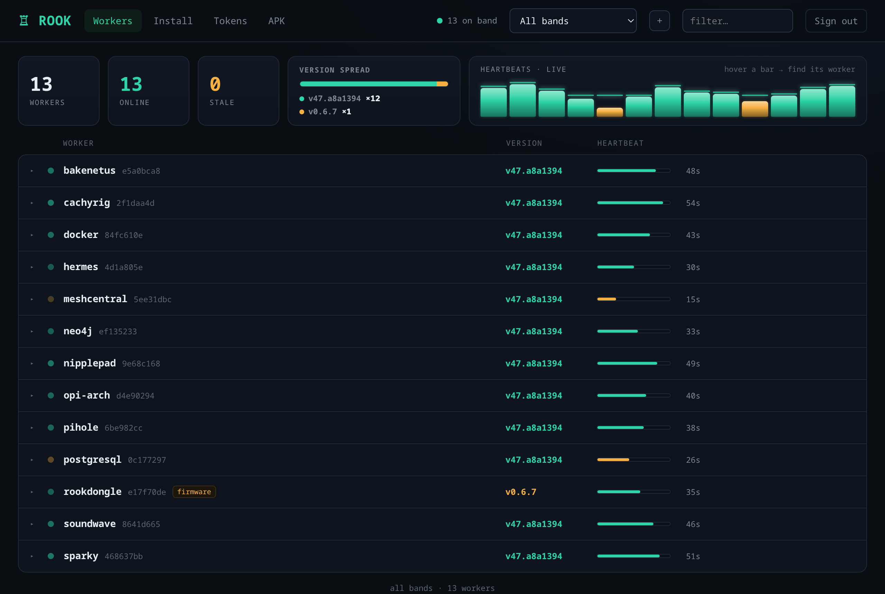
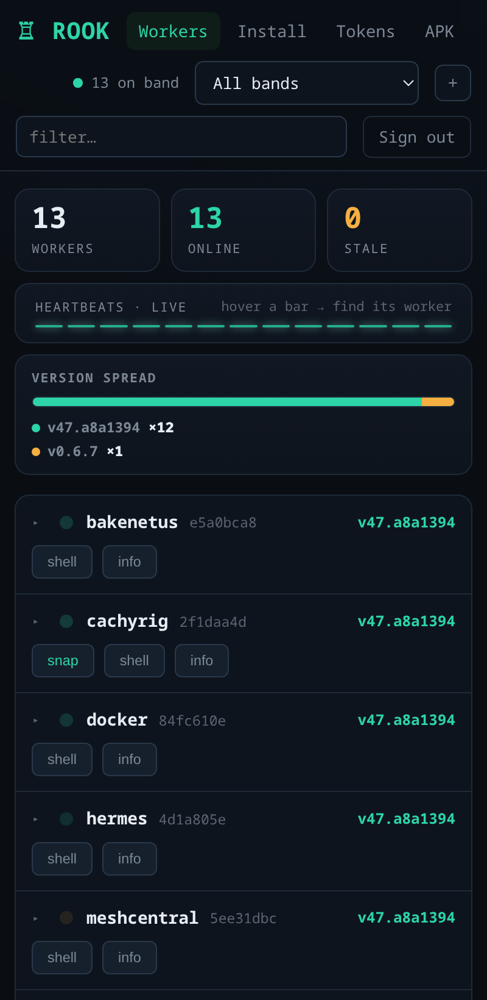
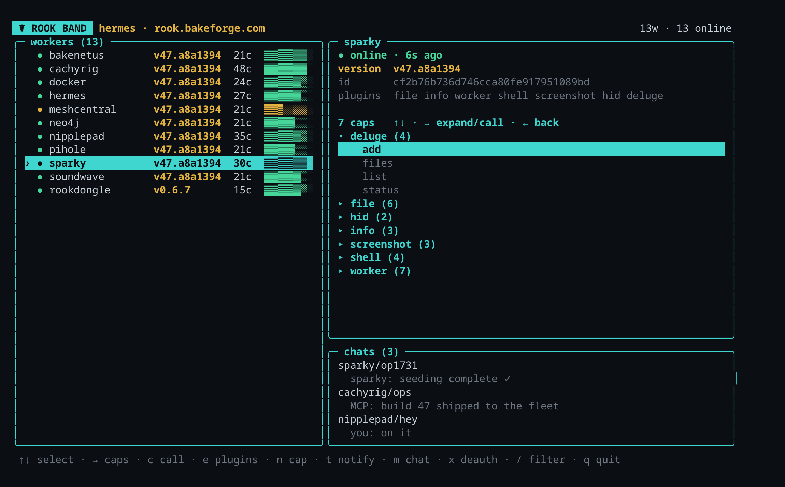
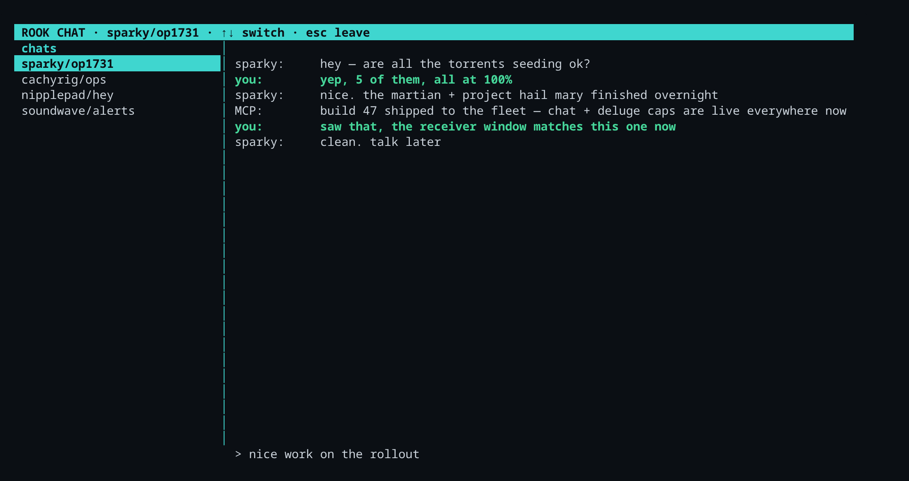

# Rook

**A self-updating mesh of worker agents you drive from a web dashboard, a terminal control panel, or an MCP — over an encrypted peer-to-peer band.**

Rook turns any set of machines — Linux, Windows, macOS, Android/Termux, even an ESP32 dongle — into a **band**: a fleet of lightweight workers that expose *capabilities* (run a shell command, grab a screenshot, drive HID/KVM, manage torrents, chat, …) over an encrypted mesh. You control the whole fleet from a browser, a terminal, or from Claude via MCP — and the fleet **updates itself over the air**.

It grew out of a personal AI agent (Discord bot + memory kernel, still here — see [The agent](#the-agent)), but the center of gravity today is the band and its control planes.



---

## Table of contents

- [The band](#the-band)
- [Capabilities](#capabilities)
- [Control planes](#control-planes) — [dashboard](#web-dashboard) · [`rook band` TUI](#rook-band--terminal-control-panel) · [chat](#chat--messaging) · [MCP](#mcp)
- [OTA self-update](#ota-self-update)
- [Security](#security)
- [Install](#install)
- [The agent](#the-agent)
- [Repository layout](#repository-layout)

---

## The band

A **band** is a group of workers that share one pre-shared key (PSK). Everything rides on [**telesthete**](https://pypi.org/project/telesthete/), a small encrypted transport:

- **Membership by PSK.** `band_id = SHA256(PSK)[:16]` is the cleartext routing label; the AEAD key is derived from the PSK (ChaCha20-Poly1305). Knowing the PSK = being on the band.
- **Hub-and-spoke over a blind relay.** Workers connect out (UDP on the LAN, or WebSocket through a Cloudflare tunnel for anything remote) to a **hub** that relays band traffic by `band_id` — it holds no key and can't read the payloads.
- **Workers announce themselves** every ~30s with their name, version, plugins, and capabilities. The control plane keeps a live roster; a worker that goes quiet ages off in ~90s.
- **Stable identity.** Each worker persists a `worker_id` across restarts, so it keeps one row in the dashboard and can be durably addressed.

```
  browser ─┐                              ┌─ worker: cachyrig  (shell, screenshot, hid, hermes, …)
  rook TUI ─┼─ dashboard / MCP ─ hub ─────┼─ worker: sparky    (deluge, screenshot, hid, …)
  Claude ──┘        (relay)               ├─ worker: soundwave  ┐ Proxmox host, one worker per LXC
                                          ├─ worker: pihole     ┤ (pihole / neo4j / postgres / …)
                                          └─ worker: rookdongle  ESP32 firmware (KVM/HID over BLE)
```

## Capabilities

A worker's abilities are **plugins** that register dot-namespaced **capabilities**. A plugin only loads where it can actually function (`available()` gating), so a worker never advertises a cap it can't fulfill — a headless box won't offer `screenshot.*`, a box without deluge won't offer `deluge.*`.

Built-in plugins:

| Namespace | What it does |
|---|---|
| `shell.*` | run commands, `which`, env |
| `file.*` | read / write / list / search (base64 for binaries) |
| `info.*` | host, uptime, ping |
| `screenshot.*` | cross-platform display capture (X11 / wlroots / KDE / GNOME / Windows / Android) |
| `hid.*` | type / key-combo / mouse on the local display |
| `kvm.* · bthid.* · serial.*` | ESP32 dongle: USB-HID, Bluetooth-HID, serial passthrough |
| `deluge.*` | list / add / pause / resume / remove torrents; pull files over the band |
| `chat.* · msg.*` | two-way chat and one-way desktop notifications |
| `claude-history.*` | search / export local Claude Code sessions |
| `hermes.*` | drive a co-located [hermes](#the-agent) agent (chat, run, skills, memory) |
| `worker.*` | `restart`, `reconfigure`, signed `apply`/`deauth`, `hold`, runtime `plugin.enable/disable` |
| `caps.describe` | introspect every cap's args (powers the call forms) |

**Custom command-caps.** Define your own cap that runs a shell command with parameter substitution — e.g. `cmd.deploy` → `systemctl restart {svc}` — persisted per-worker and re-registered on boot. Argument *values* are shell-escaped, so a caller can't break out of the template.

## Control planes

Drive the same band three ways — they all read from the same roster and invoke the same caps.

### Web dashboard

A band-first control panel: live worker list, version-spread and heartbeat visualizations, click-to-expand capabilities, run any cap from a form, an in-browser shell, token/install/APK pages, and one-click **deauth/ban**. Fully responsive.

<p>
  
</p>

### `rook band` — terminal control panel

A btop-inspired, zero-dependency curses TUI (pure stdlib). Framed panels: a worker list on the left, a live **detail pane** for the selected worker on the right — arrow into it to browse capabilities as a tree and call one — and a **chats** panel. Run caps, toggle plugins, define custom caps, message workers, deauth/ban.



Install it as a single self-contained command (it just needs `python3`):

```sh
curl -fsSL https://<your-host>/rook | bash
# then just: rook
```

### Chat & messaging

Two flavors, both worker-gated:

- **notify** — a one-way desktop toast (`notify-send`) plus an inbox on the target.
- **chat** — a proper two-way conversation. Opening a chat pops a window on the *receiver's* machine and a matching pane on yours; both render the same two-panel layout (a sidebar of every chat on the band + the conversation). Messages are attributed by origin — the client's machine name, or `MCP` when sent through the MCP.



### MCP

Expose the band to Claude as tools:

```
rook_workers()                       # live roster
rook_caps()                          # every capability seen on the band
rook_call(cap, args, worker_id?)     # invoke a capability, get the reply
```

## OTA self-update

The Python worker fleet updates itself with a **signed-manifest + in-band push** system:

- Every build stamps a monotonic build number and emits an **ed25519-signed** manifest (`{build, sha256, url, sig}`) next to the bundle.
- The controller watches each worker's announced build and pushes `worker.apply(manifest)` to any worker that's behind. Workers **verify signature + sha256 + a `--selftest`** before swapping (fail-closed), keep the previous bundle for **rollback**, and restart kill-safely (systemd / runit / `os.execv`).
- `worker.hold` pins a node; `worker.check(force=true)` drives canary rollouts. The **dongle** (ESP32 firmware) is excluded and has its own signed flash path.

Ship a build → commit → rebuild the signed bundle → the running push loop converges the whole fleet in minutes, no manual per-device steps.

## Security

- **Signed control.** `worker.apply` and `worker.deauth` act only on an ed25519-signed payload, so *being on the band is not enough* to update or evict a worker — only the controller's signing key can. Deauth parks a worker off-band (persisted, survives reboots) and the controller denylists it (hidden, no pushes, calls refused).
- **AEAD hardening.** The per-session nonce counter is seeded from a CSPRNG to prevent cross-peer / cross-restart nonce reuse under the shared band key.
- **Roadmap.** Per-worker identity (to evict *hostile* nodes, not just cooperative ones), PSK rotation tooling, and signed firmware OTA are the next hardening steps.

> The band PSK, signing key, and dashboard credentials live only on your hosts — never in the repo. The install commands here use `<your-host>` placeholders.

## Install

**A worker** (Linux / macOS / Termux):

```sh
curl -fsSL https://<your-host>/worker | bash
```

Windows (PowerShell) and a native Android APK are served from the same host (`/worker.py`, `/apk`). The **`rook band` TUI** installs with `curl -fsSL https://<your-host>/rook | bash` (see above).

## The agent

Rook's original half is a personal AI agent, still included and usable:

- **Multi-model routing** between local LLMs (LM Studio) and Anthropic (Claude), switchable in natural language, with OAuth for Claude Code subscriptions.
- **3-tier memory kernel** — volatile / working / concrete fact tiers with automatic extraction, promotion, and persistence.
- **Discord bot** — a full tool-calling agent with editable status messages and cross-channel awareness.
- **Sub-agents, persistent terminals, a cron/one-shot job scheduler, and a knowledge graph** (KuzuDB alongside SQLite).

```sh
git clone https://github.com/Bake-Ware/rook.git && cd rook && pip install -e .
python -m rook          # Discord mode
python -m rook --cli    # local CLI
```

Agent workers expose themselves to the band via the `hermes.*` capabilities, so you can chat with or task an agent from the dashboard, the TUI, or MCP.

## Repository layout

```
rook/
  worker/          band worker: core, transports (telesthete), plugins, OTA self-update
    plugins/       shell, file, info, screenshot, hid, pikvm, deluge, chat, msg, …
  band_mcp/        band client + the R00K MCP server (rook_workers/caps/call)
  remote/          installer / controller (dashboard API, OTA build + push, deauth)
  web/             the dashboard (index.html)
  cli/             band_tui.py — the `rook band` terminal control panel
  core/ modules/ interfaces/   the agent (models, memory, Discord, tools)
firmware/          ESP32 T-Dongle-S3 firmware (telesthete over UDP, BLE/USB HID)
docs/img/          screenshots
```
