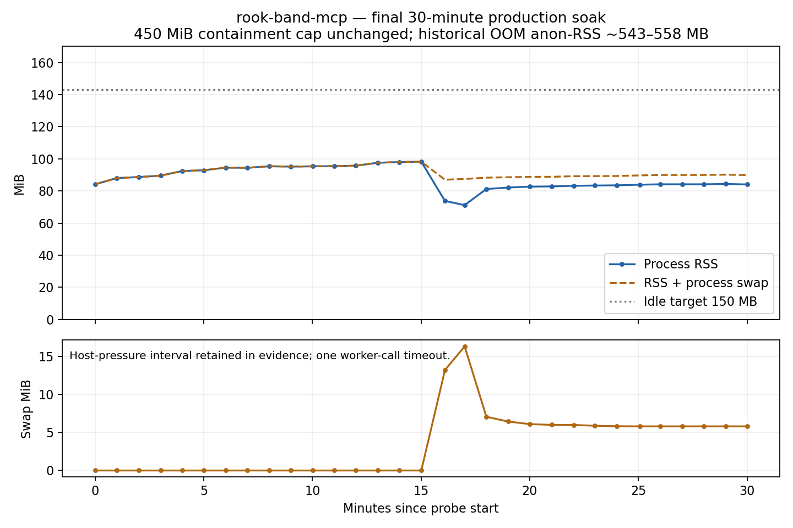

# rook-band-mcp memory repair

Status: final code deployed; the 30-minute memory acceptance window is complete.
**Memory target met; strict p95 latency acceptance remains OPEN.** The quiet
comparison also had a higher p95 than the original short baseline.

## Source and commits

Worked directly in `/home/bake/rook`, branch `master`, using cachyrig's current
working tree. Committed Bake's existing tracked edits first, separately:

| Commit | Change |
|---|---|
| `f71d95d` | `band_mcp: OAuth shim changes already running in production` — existing OAuth callback validation and .gitignore edits only. |
| `0c1e951` | Bounded stateful MCP ownership, failed-send cleanup, OAuth/admin bounds, diagnostics, harness and regressions. |
| `0852284` | Bounded unterminated console output with lossless persistence; expanded mixed harness. Final deployed source. |

These source commits are pushed to origin master. A final documentation/
diagnostics commit records the evidence and raises the package minimum to
MCP 1.27.1, matching the adapter API requirement. Production dependencies and
runtime modules remain the verified 0852284 release. No stale worktree was used. The
untracked `.claude-briefs/`, `firmware-rp2040/`, dongle files and existing OAuth
test file were not modified or committed. Existing OAuth tests were run.

## Changes

- Stateful MCP sessions: idle TTL 300 s, maximum 128 sessions and 256 concurrent
  HTTP requests. Active POSTs suspend idle expiry. New work over capacity gets
  503/Retry-After; existing active sessions are not evicted. Expired IDs get 404.
- Explicit task/transport ownership cleanup for DELETE, expiry, shutdown,
  cancellation and send errors, including SSE errors swallowed by the SDK.
- BandClient: at most 512 pending calls; one timeout covers send plus reply;
  `finally` removes and cancels futures on every exit, including serialization,
  failed send and cancellation.
- OAuth: at most 1,024 outstanding five-minute codes, query fields capped at
  4,096 characters; expiry sweep on authorization/token requests. Existing
  token issuance, refresh and loopback callback semantics preserved.
- Admin sessions: expired records swept on login, maximum 256 sessions.
- Console: persist complete 4,000-character pieces even without a newline;
  keep only a shorter tail per live room. No output is discarded.
- Optional SIGUSR2 tracing toggle and SIGUSR1 allocation-summary diagnostics;
  off by default. No full heap dumps or object values written.

No production dependency upgrades, hub/remote changes, or containment removal.
The diagnostic signal handler was also exercised in an isolated process: tracing
off, enable, allocation-site snapshot, disable; no object contents logged.
The bridge uses its existing Python 3.12 venv, MCP 1.27.1, Starlette 1.0.0,
Uvicorn 0.47.0 and AnyIO 4.13.0.

## Reproduction and regression results

`tools/diagnostics/band_mcp_memory.py` exercises real ASGI MCP initialize,
initialized notification, DELETE/abandonment, workers list, mixed rook_call
replies/timeouts/send failures, console/chat reads, OAuth authorization and
successful token exchange/refresh. Its worker transport is synthetic, while
HTTP/auth/session/tool/database paths are real. The production probe separately
uses the actual worker transport.

Old control: after 200 sessions and 2,400 calls, 200 transports, 100 live
ServerSession objects, 200 failed-send futures, 302 tasks. RSS rose through all
five batches to 107,628 KiB with tracemalloc enabled in the final matched
control. The final fixed mixed
harness, after accelerated idle expiry, has zero transports/server sessions/
pending futures and two harness tasks; peak RSS 97,292 KiB. Traced live bytes
are about 2.44 MB versus 8.06 MB in the matched old-code run. OAuth codes still
within their TTL remain intentionally retained but are bounded.

The first old allocation run used local AnyIO 4.15.1; subsequent runs aligned
it to production 4.13.0. Local Python is 3.14, so local RSS is not interchangeable
with production RSS. Allocation tracing is excluded from latency benchmarks.
A separate default-TTL run completed 4,992 mixed calls while reaching the
128-session ceiling, rejecting excess new sessions and reclaiming expired ones.
Its traced RSS settled at 109,428–109,860 KiB across the last six batches.
Evidence is under `evidence/`, including allocation sites and actual objgraph
back-reference chains (`manager → dict → transport`, `client → dict → future`);
no object contents or credentials are emitted.

Final relevant suite on production SDK 1.27.1: **72 passed**. All **13 new
memory regressions also pass on SDK 1.30.0** in the existing local venv. This includes existing WebSocket,
band-management/overview, OAuth and console tests plus the new memory tests.
Tests requiring local sockets were rerun with the needed execution permission;
the initial sandbox failures were socket PermissionError, not application
failures. The old-code control fails DELETE cleanup, abandoned-session expiry,
failed-send, cancelled-send and serialization cleanup. The new console test
checks 819,200 characters without a newline remain bounded and are recovered
exactly from persistence.

A separate 5,000-call, single-session successful-roundtrip control plateaus on
both versions: old final RSS 89,088 KiB, new 88,556 KiB. Batch p50 ranges were
3.28–3.72 ms before and 3.49–3.66 ms after; p95 ranges 4.39–5.59 ms and
4.85–5.30 ms. This does not show a material steady-call regression; churn and
failure-path retention differ strongly. Production latency is the acceptance
measurement, using the same on-host HTTP boundary before and after.

## Deployment and rollback record

1. Verified active source was `/opt/rook-releases/voice-20260910-84f2e66`,
   selected by existing `90-enrollment-upgrade.conf` and PYTHONPATH. Updating
   an unused site-packages copy would not have changed the running service.
2. Downloaded the exact pushed commits into new root-owned versioned release
   directories. Verified changed module hashes against cachyrig, and built
   the server using the production venv before switching it.
3. Backed up active code to `/opt/rook-band-mcp/rollback-20260921-1132/rook`.
   Preserved the old release, existing credential paths and shared databases.
   Wrote and syntax-checked a bridge-only rollback script.
4. Armed `bandmcp-rollback.timer` for 600 s; checked active; wrote only
   `/etc/systemd/system/rook-band-mcp.service.d/zzz-memory-fix.conf`; reloaded
   systemd; scheduled `bandmcp-restart` after 3 s. First fix active at 11:32:55.
5. Verified exact release, active service, 28-worker roster and real call on
   first scheduled reconnect check; canceled the timer after verification.
6. The buffer review then identified the unterminated-line defect. Committed
   and tested the targeted follow-up, staged final release
   `/opt/rook-releases/bandmcp-20260921-0852284`, backed up the prior code and
   bridge-only override under `rollback-20260921-1140`, then used a fresh
   `bandmcp-rollback-final` 600 s timer and detached restart.
7. Final release active at **11:38:49 UTC**, PID **155846**. First reconnect
   check succeeded. Workers and real `printf final-fix-roundtrip` reply passed.
   Final rollback timer disarmed at **11:40:02 UTC**. Neither rollback fired.
8. Hub PID **725**, started Sep 13 04:34:21 UTC, and rook-remote PID **113646**,
   started Sep 18 16:50:45 UTC, were unchanged across both deployments.

Current release override contains only:

```ini
[Service]
WorkingDirectory=/opt/rook-releases/bandmcp-20260921-0852284
Environment=PYTHONPATH=/opt/rook-releases/bandmcp-20260921-0852284
```

Rollback to the previous verified session/call fix (detached when using Rook):

```sh
sudo -n systemd-run --unit=bandmcp-manual-rollback-$(date -u +%Y%m%dT%H%M%S) --collect --on-active=3 /bin/sh /opt/rook-band-mcp/rollback-20260921-1140/rollback.sh
```

Emergency full rollback to the original OAuth-patched release:

```sh
sudo -n systemd-run --unit=bandmcp-original-rollback-$(date -u +%Y%m%dT%H%M%S) --collect --on-active=3 /bin/sh /opt/rook-band-mcp/rollback-20260921-1132/rollback.sh
```

Scripts restore release selection, reload systemd and restart only the bridge.
The original script removes only the added override; the old release was not
modified. Code backups are retained. Containment and shared databases remain
in place. Scripts were syntax-checked; their execution was not required after
successful deploy verification. RECOVERY.md has the complete dead-man pattern.

## Before measurements

Historical incident anonymous RSS at the first four kills: approximately
543–558 MB. Bake's fifth-event update reports about 424 MB in under four hours.
Those are historical figures, not the short new baseline's measured peak.

Production baseline 11:25:21–11:27:21 UTC, 120.68 seconds, PID 153960:

| Measurement | Before |
|---|---:|
| Process RSS start / end (= HWM at end) | 104,972 / 108,952 KiB (102.5 / 106.4 MiB) |
| Successful calls / errors | 115 / 0 |
| Actual aggregate rate | 0.953 calls/s (paced at up to 1/s) |
| rook_call sample count | 57 |
| rook_call p50 / p95 | 32.030 / 198.023 ms |
| rook_workers sample count | 58 |
| rook_workers p50 / p95 | 11.538 / 117.517 ms |

Measurement boundary: local HTTP MCP request through the running bridge and,
for rook_call, a real `shell.exec` round trip to bakenetcanada. This excludes
public Internet/client-tool orchestration latency. The probe reads an existing
token into memory only and records status/latency/RSS scalars. It alternates
worker-list and real calls; rotates sessions every 60 calls, alternately DELETE
and abandon. All responses are validated, not just timed HTTP 200s.

## Soak record

Initial short probe on 0c1e951 is retained as an incomplete intermediate run.
A historical journal query timed out during host-wide pressure and swap; its
latency and reduced RSS are not presented as a successful acceptance plateau.
That probe was stopped intentionally for the console-buffer deployment.

The final run also retains a 10-second worker-call timeout at 11:56:09 UTC
during a second diagnostic journal-query/host-pressure interval. The bridge did
not restart. This is disclosed rather than removed from the error or latency
statistics; RSS plus swap is evaluated to avoid crediting swapping as a fix.

Final acceptance probe: `/tmp/bandmcp-final.jsonl`, started 11:40:03 UTC on
0852284, requested duration 1,800 seconds. One process RSS/HWM/swap sample per
minute, per-call timing and validated status. The run completed at 12:10:04 UTC after **1,800.29 seconds**, with **31 memory
samples**, one unchanged PID and **zero unexpected restarts**. There were
**1,759 calls, 1,758 successful, one timeout** (99.943% success). Aggregate paced
rate was **0.977 calls/s**, versus 0.953 before. These are achieved paced rates,
not maximum server capacity benchmarks.

| Measurement | Before baseline | Full 30-minute final soak |
|---|---:|---:|
| Process peak RSS / HWM | 106.40 MiB | 98.46 MiB (103.24 MB) |
| Sampled peak RSS | 106.40 MiB | 98.25 MiB |
| Maximum process swap | 0 | 16.30 MiB during host pressure |
| Last-ten-minute RSS + swap | N/A, short baseline | 88.81–90.16 MiB |
| rook_call p50 / p95 | 32.030 / 198.023 ms | 21.336 / 403.647 ms |
| rook_workers p50 / p95 | 11.538 / 117.517 ms | 12.047 / 211.861 ms |
| Calls / failures | 115 / 0 | 1,759 / 1 |
| Unplanned bridge restarts | 0 | 0 |

Memory remains below both the 150 MB idle target and 500 MB hard target during
this measured load, far from the 450 MiB containment ceiling. The plateau claim
uses bounded object ownership and the last ten minutes of RSS **plus swap**;
it does not credit the pressure-induced RSS drop as reclamation. The final
RSS+swap band is only 1.35 MiB wide. Normal background clients remained active,
so this is not a zero-client idle experiment.

The full-window p95 worsened, despite a faster real-call median and slightly
higher achieved throughput. The pressure interval and single timeout are
included. Do not describe these data as proving the strict latency target.
The controlled A/B and subsequent quiet window are separate measurements.



| UTC | Elapsed min | PID | RSS MiB | HWM MiB | Swap MiB |
|---|---:|---:|---:|---:|---:|
| 2026-09-21T11:40:04Z | 0.00 | 155846 | 84.14 | 84.14 | 0.00 |
| 2026-09-21T11:41:04Z | 1.00 | 155846 | 88.06 | 88.06 | 0.00 |
| 2026-09-21T11:42:04Z | 2.01 | 155846 | 88.67 | 88.98 | 0.00 |
| 2026-09-21T11:43:04Z | 3.01 | 155846 | 89.54 | 89.54 | 0.00 |
| 2026-09-21T11:44:04Z | 4.00 | 155846 | 92.43 | 92.43 | 0.00 |
| 2026-09-21T11:45:04Z | 5.01 | 155846 | 92.90 | 92.90 | 0.00 |
| 2026-09-21T11:46:04Z | 6.01 | 155846 | 94.55 | 94.55 | 0.00 |
| 2026-09-21T11:47:04Z | 7.01 | 155846 | 94.43 | 94.43 | 0.00 |
| 2026-09-21T11:48:04Z | 8.01 | 155846 | 95.39 | 95.39 | 0.00 |
| 2026-09-21T11:49:04Z | 9.01 | 155846 | 95.18 | 95.32 | 0.00 |
| 2026-09-21T11:50:04Z | 10.01 | 155846 | 95.35 | 95.35 | 0.00 |
| 2026-09-21T11:51:04Z | 11.02 | 155846 | 95.43 | 95.43 | 0.00 |
| 2026-09-21T11:52:04Z | 12.00 | 155846 | 95.76 | 95.76 | 0.00 |
| 2026-09-21T11:53:04Z | 13.00 | 155846 | 97.55 | 97.55 | 0.00 |
| 2026-09-21T11:54:04Z | 14.01 | 155846 | 98.02 | 98.04 | 0.00 |
| 2026-09-21T11:55:04Z | 15.01 | 155846 | 98.25 | 98.25 | 0.00 |
| 2026-09-21T11:56:10Z | 16.10 | 155846 | 73.80 | 98.46 | 13.20 |
| 2026-09-21T11:57:04Z | 17.00 | 155846 | 71.19 | 98.46 | 16.30 |
| 2026-09-21T11:58:04Z | 18.00 | 155846 | 81.24 | 98.46 | 7.05 |
| 2026-09-21T11:59:04Z | 19.01 | 155846 | 82.12 | 98.46 | 6.43 |
| 2026-09-21T12:00:04Z | 20.01 | 155846 | 82.72 | 98.46 | 6.09 |
| 2026-09-21T12:01:04Z | 21.01 | 155846 | 82.85 | 98.46 | 5.99 |
| 2026-09-21T12:02:05Z | 22.02 | 155846 | 83.21 | 98.46 | 5.98 |
| 2026-09-21T12:03:04Z | 23.00 | 155846 | 83.39 | 98.46 | 5.88 |
| 2026-09-21T12:04:04Z | 24.00 | 155846 | 83.52 | 98.46 | 5.81 |
| 2026-09-21T12:05:08Z | 25.07 | 155846 | 83.91 | 98.46 | 5.80 |
| 2026-09-21T12:06:04Z | 26.01 | 155846 | 84.16 | 98.46 | 5.80 |
| 2026-09-21T12:07:04Z | 27.01 | 155846 | 84.16 | 98.46 | 5.80 |
| 2026-09-21T12:08:04Z | 28.01 | 155846 | 84.16 | 98.46 | 5.80 |
| 2026-09-21T12:09:04Z | 29.02 | 155846 | 84.37 | 98.46 | 5.80 |
| 2026-09-21T12:10:04Z | 30.00 | 155846 | 84.07 | 98.46 | 5.80 |


## Controlled on-host latency comparison

The full soak includes ambient host jitter and a diagnostic journal-query
pressure interval. To isolate the changed call/session machinery, an additional
probe alternated 100 old and 100 fixed real worker calls in randomized pairs,
on the same host and band transport with isolated ASGI apps/stores. The old
variant uses the prior deployed BandClient.call and upstream SDK manager;
the fixed variant uses the new lifetime code. This is an algorithm A/B, not
a rollback of the production service. No actual credentials are persisted.

| Variant | Calls / errors | p50 ms | p95 ms |
|---|---:|---:|---:|
| Old lifecycle | 100 / 0 | 23.912 | 299.804 |
| Fixed lifecycle | 100 / 0 | 23.379 | 313.141 |

The median paired difference is 0.0095 ms. The observed p95 delta is +13.337 ms
(+4.4%); a paired bootstrap 95% interval spans -79.7 to +299.3 ms, so these noisy
tails do not establish a small performance change or prove strict equivalence.
The initial helper tried an obsolete startup band setting and collected no
measurements; the completed helper reads active enrollment read-only. Its
process is stopped. Source and scalar evidence are retained.

## Quiet matched-duration latency window and final status

A predeclared repeat of the original 120-second probe ran **12:10:53–12:12:53
UTC**, after the soak and other diagnostic processes ended. No management
requests were added during that interval. It completed **120/120 calls** in
**120.21 seconds** (0.998 calls/s), with unchanged RSS+swap: **92,020 KiB** at
both start and end. This independently supports the memory plateau.

| Measurement | Before 120-second window | Quiet after window |
|---|---:|---:|
| rook_call p50 / p95 | 32.030 / 198.023 ms (57 calls) | 21.258 / 292.432 ms (60 calls) |
| rook_workers p50 / p95 | 11.538 / 117.517 ms (58 calls) | 11.805 / 211.047 ms (60 calls) |
| Calls / errors | 115 / 0 | 120 / 0 |
| Achieved paced rate | 0.953 calls/s | 0.998 calls/s |

**The strict no-p95-regression requirement is not demonstrated.** Median real
call latency and achieved throughput improved, while tail latency remains
higher than the short pre-deploy baseline. Controlled A/B shows comparable
old/fixed tails on the same host, but its uncertainty is too wide to certify
strict equivalence. The repair is deployed and the memory target is met;
performance acceptance remains open for a stable, larger baseline and host-tail
latency investigation. No unrelated service tuning or additional speculative
source changes were made to conceal this limitation.

Final read-only verification: bridge PID 155846 active on the exact final
release, NRestarts=0, RSS 86,144 KiB / HWM 100,824 KiB / swap 5,876 KiB; 28-worker
roster and a real worker round trip succeeded. Hub/rook-remote PIDs and start
times remained unchanged. Both dead-man timers are inactive. Two planned
bridge-only restarts occurred; no rollback or unexpected restart occurred.

## Remaining follow-ups

RCA.md tracks independent SSH/serial recovery access, sshd password-auth
hardening, rook-remote secrets migration and rotation, RSS/restart alerts,
explicit Hermes cron model/provider, and longer trend monitoring. These are
not silently claimed complete; no unrelated service changes were made.
